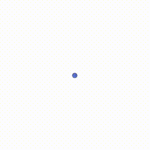

# Wavefuse

## Purpose
Perform a time-integration of a [reaction-diffusion system](https://en.wikipedia.org/wiki/Reaction%E2%80%93diffusion_system) in 3D using the [FTCS algorithm](https://en.wikipedia.org/wiki/FTCS_scheme) on a GPU. Currently, only [Gray-Scott](https://groups.csail.mit.edu/mac/projects/amorphous/GrayScott/) kinetics are implemented.

## Example


| Setting        | Value           |
| -------------- |:---------------:|
| Type           | Gray-Scott      |
| Size           | 256<sup>3</sup> |
| dt             | 0.25            |
| dx             | 0.50            |
| f              | 0.0625          |
| k              | 0.0416          |
| Da             | 0.16            |
| Db             | 0.08            |

## Compilation instructions
Assuming that you have [CUDA](https://en.wikipedia.org/wiki/CUDA) installed, the compilation is roughly as follows:

```
mkdir build
cd build
cmake ../src
make -j9
```

CMake should automagically detect your CUDA installation.
